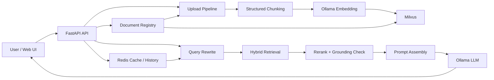

# AI-RAG-System

一个面向本地文档问答场景的 RAG 项目，围绕 `Hybrid Retrieval + Query Rewrite + Rerank + No-Answer Gating + Evaluation` 做了完整实现。
不仅能上传文档并进行问答，还可以观察检索过程、调试查询改写效果，并通过 benchmark 持续评估优化前后的质量变化。

## Features

- 本地知识库问答：支持上传 `PDF / TXT / MD` 文件并建立知识库
- 分层切块：按 `document -> section -> paragraph -> chunk` 组织文档结构
- Hybrid Retrieval：向量检索 + 词法检索 + RRF 融合
- Query Rewrite：针对追问场景自动改写检索查询
- Rerank + No-Answer：对候选片段重排，并在证据不足时拒答
- 来源可解释：前端展示命中来源、chunk 片段、rerank 分数、overlap 等调试信息
- 本地模型优先：默认通过 Ollama 调用本地 LLM，并使用本地 Ollama Embedding
- Evaluation：支持批量 benchmark、多轮 case、Markdown / JSON 报告输出
- 文档管理：支持文档注册表、同名文档去重策略、删除文档、重建索引、多文档 benchmark 自动发现

## Tech Stack

- Backend: FastAPI, LangGraph, Python
- Frontend: React, Vite, Axios
- Vector DB: Milvus
- Cache / Memory: Redis
- Local LLM / Embedding: Ollama
- Document Processing: PyPDF, LangChain text splitters
- Evaluation: custom benchmark runner + report generator

## Architecture



## Current Capabilities

### Retrieval Pipeline

1. 用户问题进入 LangGraph 主流程
2. 根据最近对话历史执行 Query Rewrite
3. 在 Milvus 中执行向量检索
4. 对候选结果执行词法打分与 RRF 融合
5. 基于 overlap / semantic distance / hybrid score 做 rerank
6. 如果证据不足，直接返回 no-answer
7. 如果证据充分，拼接上下文并调用本地 LLM 生成答案

### Evaluation Pipeline

- 支持 direct QA / follow-up QA / abstention case
- 支持 case tags 统计，如 `summary`、`rewrite`、`safety`
- 支持多文档 suite，并按 `source_filters` 做文档级隔离评测
- 自动发现知识库中的已索引文档并生成 benchmark 模板
- 自动输出：
  - `data/eval/reports/*_latest.json`
  - `data/eval/reports/*_latest.md`
- 便于记录每次检索策略优化前后的结果变化

### Document Management

- 上传文件会写入本地文档注册表：`data/document_registry.json`
- 默认去重策略为 `replace`，可通过 `UPLOAD_DUPLICATE_POLICY=replace|skip|error` 调整
- 新上传文件默认保存到 `data/uploads/<user_id>/<kb_id>/`
- 支持列出知识库文档、删除文档、重建索引
- 删除和重建索引时会刷新知识库缓存版本，并清空当前知识库对话历史，避免命中旧答案

## Project Structure

```text
app/
  api/                FastAPI routes
  cache/              Redis cache and conversation history
  evaluation/         Benchmark runner and report generation
  knowledge/          Document loading, chunking, embeddings, Milvus storage
  llm/                Ollama client
  rag/                Query rewrite, retrieval, ranking, graph workflow
web/react-ui/
  src/                UI and retrieval observability panel
data/
  eval/               Benchmarks, suites, and generated reports
  uploads/            Uploaded files grouped by user_id/kb_id
```

## API Endpoints

- `POST /api/upload`
  - form-data: `file`, `user_id`, `kb_id`
- `GET /api/documents?user_id=...&kb_id=...`
- `DELETE /api/documents?user_id=...&kb_id=...&source=...`
- `POST /api/documents/reindex`
  - JSON: `{"user_id": "user001", "kb_id": "defaultkb", "source": "your-file.pdf"}`
- `POST /api/chat`

## Evaluation Commands

列出当前知识库已索引文档：

```bash
python -m app.evaluation.benchmark --list-sources --user-id user001 --kb-id defaultkb
```

基于当前知识库自动生成多文档 benchmark 模板：

```bash
python -m app.evaluation.benchmark --generate-suite-template --user-id user001 --kb-id defaultkb --benchmarks-dir data/eval/benchmarks/generated --suite-output data/eval/generated_multi_doc_suite.json
```

运行多文档评测：

```bash
python -m app.evaluation.benchmark --suite data/eval/generated_multi_doc_suite.json
```
