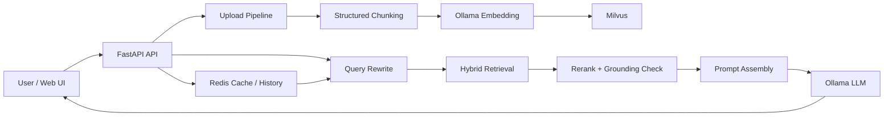

# AI-RAG-System

一个面向本地文档问答场景的 RAG 项目，围绕 `Hybrid Retrieval + Query Rewrite + Rerank + No-Answer Gating + Evaluation` 做了完整实现。

这个仓库最初是一个基础版 RAG Demo，现在已经升级为更适合 **AI 开发岗 / AI 应用开发岗** 展示的版本：不仅能上传文档并进行问答，还可以观察检索过程、调试查询改写效果，并通过 benchmark 持续评估优化前后的质量变化。

## Features

- 本地知识库问答：支持上传 `PDF / TXT / MD` 文件并建立知识库
- 分层切块：按 `document -> section -> paragraph -> chunk` 组织文档结构
- Hybrid Retrieval：向量检索 + 词法检索 + RRF 融合
- Query Rewrite：针对追问场景自动改写检索查询
- Rerank + No-Answer：对候选片段重排，并在证据不足时拒答
- 来源可解释：前端展示命中来源、chunk 片段、rerank 分数、overlap 等调试信息
- 本地模型优先：默认通过 Ollama 调用本地 LLM，并使用本地 Ollama Embedding
- Evaluation：支持批量 benchmark、多轮 case、Markdown / JSON 报告输出

## Tech Stack

- Backend: FastAPI, LangGraph, Python
- Frontend: React, Vite, Axios
- Vector DB: Milvus
- Cache / Memory: Redis
- Local LLM / Embedding: Ollama
- Document Processing: PyPDF, LangChain text splitters
- Evaluation: custom benchmark runner + report generator

## Architecture



## Current Capabilities

### Retrieval Pipeline

1. 用户问题进入 LangGraph 主流程
2. 根据最近对话历史执行 Query Rewrite
3. 在 Milvus 中执行向量检索
4. 对候选结果执行词法打分与 RRF 融合
5. 基于 overlap / semantic distance / hybrid score 做 rerank
6. 如果证据不足，直接返回 no-answer
7. 如果证据充分，拼接上下文并调用本地 LLM 生成答案

### Evaluation Pipeline

- 支持 direct QA / follow-up QA / abstention case
- 支持 case tags 统计，如 `summary`、`rewrite`、`safety`
- 自动输出：
  - `data/eval/reports/*_latest.json`
  - `data/eval/reports/*_latest.md`
- 便于记录每次检索策略优化前后的结果变化

## Project Structure

```text
app/
  api/                FastAPI routes
  cache/              Redis cache and conversation history
  evaluation/         Benchmark runner and report generation
  knowledge/          Document loading, chunking, embeddings, Milvus storage
  llm/                Ollama client
  rag/                Query rewrite, retrieval, ranking, graph workflow
web/react-ui/
  src/                React frontend and retrieval-debug UI
data/eval/
  sample_benchmark.json   Example benchmark dataset
```

## Quick Start

### 1. Clone and create venv

```powershell
git clone git@github.com:Koala-la-la/AI-RAG-System.git
cd AI-RAG-System
python -m venv .venv
.\.venv\Scripts\Activate.ps1
python -m pip install -U pip setuptools wheel
python -m pip install -r requirements.txt
```

### 2. Install frontend dependencies

```powershell
cd web\react-ui
npm install
cd ..\..
```

### 3. Start infrastructure services

```powershell
docker compose up -d
```

检查服务状态：

```powershell
docker compose ps
```

### 4. Make sure Ollama is available

推荐先准备本地模型：

```powershell
ollama list
```

当前默认配置使用：

- LLM: `qwen2.5:7b`
- Embedding: `qwen2.5:7b` via Ollama `/api/embed`

### 5. Start backend

```powershell
python -m uvicorn app.main:app --reload
```

### 6. Start frontend

```powershell
cd web\react-ui
npm run dev
```

打开：

- Frontend: [http://localhost:5173](http://localhost:5173)
- Backend docs: [http://127.0.0.1:8000/docs](http://127.0.0.1:8000/docs)

## Environment

参考仓库根目录中的 `.env.example` 配置本地环境。

关键配置说明：

- `EMBED_PROVIDER=ollama`：默认使用本地 Ollama Embedding
- `OLLAMA_MODEL`：回答生成模型
- `OLLAMA_EMBED_MODEL`：Embedding 模型
- `MILVUS_COLLECTION`：当前向量集合名称
- `MIN_RERANK_SCORE` / `MAX_SEMANTIC_DISTANCE`：控制证据强弱与拒答阈值

## Evaluation

运行完整 benchmark：

```powershell
python -m app.evaluation.benchmark
```

快速抽样运行：

```powershell
python -m app.evaluation.benchmark --limit 3
```

只打印 JSON，不写报告文件：

```powershell
python -m app.evaluation.benchmark --no-write
```

当前示例 benchmark 位于：

- `data/eval/sample_benchmark.json`

报告输出目录：

- `data/eval/reports/`

## Recommended Demo Flow

如果你想用这个项目做 GitHub 展示或面试演示，建议按这个顺序展示：

1. 上传一篇 PDF 文档
2. 问一个直接问题，如“文档的主题是什么？”
3. 再问一个追问，如“它的特点是什么？”
4. 再问一个无关问题，如“今天杭州天气怎么样？”
5. 展示左侧命中的 sources、rerank 分数和 rewritten query
6. 最后运行 benchmark，展示评测报告和通过率

## Why This Project Is Useful For Job Applications

这个版本不是单纯“调用大模型接口”的 Demo，而是更接近真实 AI 应用开发流程：

- 具备完整的文档处理和检索链路
- 具备 query rewrite / rerank / refusal 等关键 RAG 能力
- 能解释检索命中和回答来源
- 能通过 benchmark 对优化效果做量化验证
- 适合继续扩展 memory、multi-KB、reranker model、A/B evaluation 等方向

## Roadmap

- [ ] 引入独立 reranker 模型
- [ ] 支持多知识库管理与文件级管理
- [ ] 增加流式回答和更细粒度的引用展示
- [ ] 支持 benchmark 对比不同配置的实验结果
- [ ] 增加自动化回归评测与报告归档
