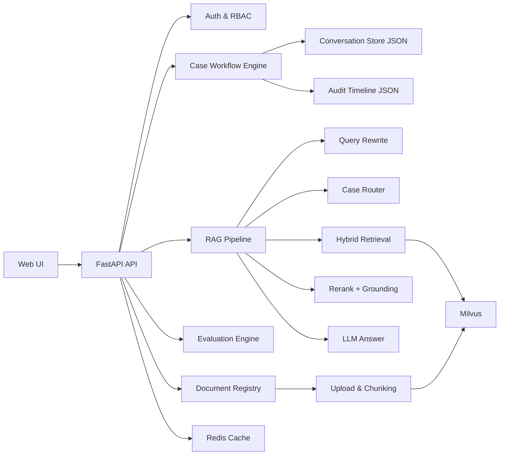

# Enterprise-KB-AI：企业内部问题处理与知识协作平台

> 一个基于 RAG 的企业内部知识系统，不止是“文档聊天”，而是面向真实工作流的“问题受理 -> 分诊 -> 排查 -> 升级 -> 结案 -> 沉淀”闭环平台。

## 一、项目地址

- GitHub（主仓库）：[https://github.com/Koala-la-la/AI-RAG-System](https://github.com/Koala-la-la/AI-RAG-System)
- GitCode（镜像仓库）：[https://gitcode.com/2501_94493648/KB-AI](https://gitcode.com/2501_94493648/KB-AI)

---

## 二、项目背景与目标

### 2.1 背景问题

在企业实际场景中，技术文档、运维手册、用户手册、API 文档通常体量很大，且知识分散。新人或跨团队同学处理问题时，常见痛点是：

- 找不到可直接执行的处理步骤
- 同类问题重复问、重复查、重复踩坑
- 不同同学给出不同口径，缺少统一标准
- 问题处理后没有沉淀，组织学习效率低

### 2.2 项目目标

本项目的目标不是做 ToC 聊天机器人，而是做一个企业内部可落地的工作台：

- 让 AI 成为“问题处理引擎”，而不是“聊天玩具”
- 让问题单具备流程状态、SLA、审计追踪能力
- 让知识库建设、问题处理、质量评测形成闭环

---

## 三、产品定位

### 3.1 为什么不是“文档聊天”

纯文档聊天只能回答“是什么”，但企业内部更关心：

- 下一步该怎么做
- 谁在什么时候做了什么
- 是否超出处理时限（SLA）
- 是否需要升级协作
- 这次处理能否沉淀为 SOP/FAQ

### 3.2 核心定位

**企业内部问题处理与知识协作平台（ToB）**

典型使用角色：

- 技术支持 / 客服支持
- 运维 / SRE
- 研发值班
- 产品运营

---

## 四、系统架构

### 4.1 技术栈

- 后端：FastAPI、Pydantic
- 前端：React、Vite、Axios
- 检索与编排：LangGraph、LangChain
- 向量数据库：Milvus
- 缓存：Redis
- 文档解析：PyPDF
- 模型：Ollama（默认）或 HuggingFace Embedding
- 评测：自定义 Benchmark + 报告生成

### 4.2 架构图



---

## 五、核心能力一览

### 5.1 问题单工作流（核心）

系统内的会话已升级为“问题单（Case）”，支持完整状态机：

- `new`（待受理）
- `triaged`（已分诊）
- `investigating`（排查中）
- `pending_escalation`（待升级）
- `escalated`（已升级）
- `resolved`（已解决）
- `archived`（已归档）

并且有合法流转校验，避免任意跳状态造成协作混乱。

### 5.2 SLA 计时与超时标记

按优先级自动生成：

- 首次响应截止时间
- 解决截止时间

并标记是否超时（响应超时 / 解决超时）。

### 5.3 审计日志（Audit Trail）

每个问题单记录操作轨迹：

- 创建问题单
- 更新字段
- 状态流转
- 消息写入
- 删除问题单

日志包含 `actor`、`timestamp`、`event_type`、`details`，支持复盘与追踪。

### 5.4 企业级知识权限

支持多用户、多团队、多级可见性：

- 角色：`member` / `admin`
- 文档权限：`private` / `team` / `org`
- 检索与评测都按权限过滤，保证“能看见才可检索”

### 5.5 RAG 高级链路

- Query Rewrite：结合上下文重写查询
- Case Router：基于问题单上下文做路由分诊
- Hybrid Retrieval：语义 + 词法混合召回
- Rerank：候选重排
- Grounded Answer：基于命中证据回答，降低幻觉

### 5.6 评测闭环

- 支持多文档 benchmark 生成与运行
- 输出 JSON / Markdown 报告
- 支持失败用例定位与质量对比

---

## 六、前端模块说明

### 6.1 登录与注册

- 独立登录页
- 支持注册团队与角色
- 登录后进入企业工作台

### 6.2 工作台（Dashboard）

展示产品层视角指标：

- 文档规模
- 问题单数量
- 最新评测结果
- 最近文档 / 最近问题单

### 6.3 问题处理页（Case Console）

三栏布局：

- 左侧：问题单列表
- 中间：问题单详情、流程动作、SLA、审计时间线、处理对话
- 右侧：引用依据（命中文档片段与元数据）

### 6.4 文档中心

支持文档上传、文档类型/权限设置、重建索引、删除文档。

### 6.5 质量评测页

支持生成并运行多文档评测，查看通过率、均分、失败案例摘要。

---

## 七、后端模块说明

项目目录（核心部分）：

```text
app/
  api/
    auth_api.py
    chat_api.py
    conversation_api.py
    document_api.py
    evaluation_api.py
    upload_api.py
  auth/
  cache/
  conversation/
    store.py
  evaluation/
    benchmark.py
  knowledge/
    access.py
    document_manager.py
    document_registry.py
    embedder.py
    milvus_store.py
    splitter.py
  llm/
    ollama_client.py
  rag/
    graph.py
    prompt.py
    ranking.py
    retriever.py
    router.py
```

核心数据目录：

```text
data/
  auth_users.json
  auth_sessions.json
  document_registry.json
  conversations/
  uploads/
  eval/
```

---

## 八、关键接口说明

### 8.1 认证

- `POST /api/auth/register`
- `POST /api/auth/login`
- `POST /api/auth/logout`

### 8.2 文档管理

- `POST /api/upload`
- `GET /api/documents`
- `DELETE /api/documents`
- `POST /api/documents/reindex`

### 8.3 问题单与流程

- `GET /api/conversations`
- `POST /api/conversations`
- `PATCH /api/conversations/{conversation_id}`
- `POST /api/conversations/{conversation_id}/transition`
- `GET /api/conversations/{conversation_id}/messages`
- `GET /api/conversations/{conversation_id}/timeline`
- `DELETE /api/conversations/{conversation_id}`

### 8.4 智能问答

- `POST /api/chat`

### 8.5 评测

- `GET /api/evaluation/latest-report`
- `POST /api/evaluation/run-generated-suite`

---

## 九、快速开始（本地部署）

### 9.1 环境准备

- Python 3.10+
- Node.js 18+
- Docker Desktop

### 9.2 安装依赖

```bash
# Python 依赖
pip install -r requirements.txt

# 前端依赖
cd web/react-ui
npm install
```

### 9.3 启动基础服务（Milvus + Redis）

```bash
docker compose up -d redis etcd minio milvus
```

### 9.4 配置环境变量

参考 `.env.example`，常用项包括：

- `MILVUS_HOST` / `MILVUS_PORT`
- `REDIS_HOST` / `REDIS_PORT`
- `OLLAMA_BASE_URL` / `OLLAMA_MODEL`
- `EMBED_PROVIDER`（`ollama` 或 `huggingface`）

### 9.5 启动后端与前端

```bash
# 项目根目录
python -m uvicorn app.main:app --reload
```

```bash
# 前端目录
cd web/react-ui
npm run dev
```

访问：`http://localhost:5173`

---

## 十、评测命令示例

### 10.1 查看当前可评测文档

```bash
python -m app.evaluation.benchmark --list-sources --user-id user001 --kb-id defaultkb
```

### 10.2 生成多文档评测模板

```bash
python -m app.evaluation.benchmark --generate-suite-template --user-id user001 --kb-id defaultkb --benchmarks-dir data/eval/benchmarks/generated --suite-output data/eval/generated_suites/user001_defaultkb.json
```

### 10.3 运行评测

```bash
python -m app.evaluation.benchmark --suite data/eval/generated_suites/user001_defaultkb.json
```

---

## 十一、常见问题排查

### 11.1 上传失败，提示 Milvus 连接失败

错误示例：

- `Fail connecting to server on 127.0.0.1:19530`

处理方式：

```bash
docker compose ps
docker compose up -d redis etcd minio milvus
```

### 11.2 HuggingFace 下载失败（WinError 10054）

这是网络波动导致的模型下载中断。可采用：

- 重试下载
- 使用本地 Ollama Embedding（`EMBED_PROVIDER=ollama`）
- 预先缓存模型后离线运行

### 11.3 终端中文乱码

若 JSON 文件内容正常但 PowerShell 显示乱码，通常是终端编码问题，不是数据损坏。

---

## 十二、项目亮点（用于实习/面试表达）

你可以用下面这句话概括项目价值：

> 我做的不是一个文档聊天 Demo，而是一个企业内部问题处理平台。系统具备问题单状态机、SLA、审计日志、权限隔离、RAG 检索链路和评测闭环，能够支撑真实团队协作场景。

建议重点展示四个能力：

- 产品思维：从“聊天”转向“流程闭环”
- 工程能力：前后端一体化 + 可部署
- AI 能力：RAG 高级链路 + 可解释引用
- 质量能力：评测体系 + 迭代对比

---

## 十三、后续规划

- 升级协作对象（研发/运维）与责任人机制
- SLA 告警与通知中心
- 失败案例自动沉淀 SOP/FAQ 候选
- 组织级知识运营看板（热点问题、知识缺口、处理效率）

---

## 十四、开源说明

欢迎提交 Issue / PR 共同完善。

如果这份 README 对你有帮助，欢迎 Star 支持。
