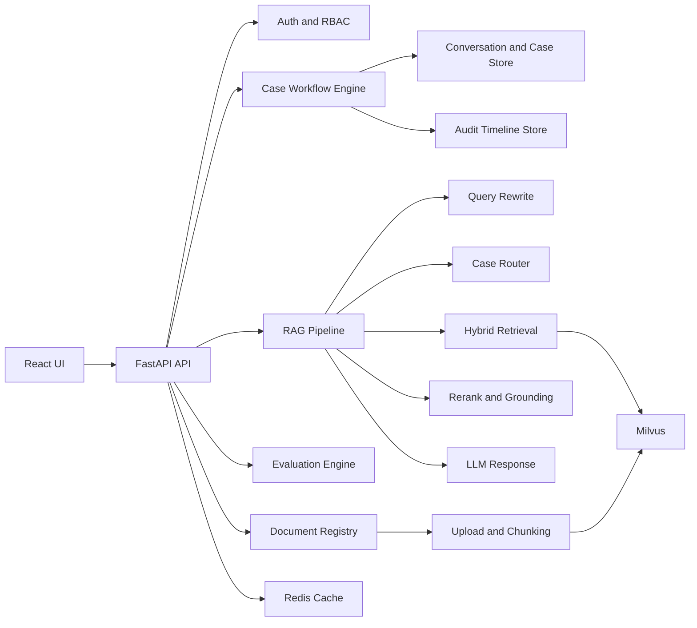

# Enterprise-KB-AI

An enterprise-grade internal knowledge and incident handling platform built on top of RAG.

Instead of a generic "chat with docs" demo, this project focuses on a real operational workflow:

**Intake -> Triage -> Investigation -> Escalation -> Resolution -> Knowledge Capture**

## Repositories

- GitHub (main): [Koala-la-la/AI-RAG-System](https://github.com/Koala-la-la/AI-RAG-System)
- GitCode (mirror): [2501_94493648/KB-AI](https://gitcode.com/2501_94493648/KB-AI)

## Why This Project

In real teams, large volumes of API docs, runbooks, SOPs, and FAQs create friction:

- Slow onboarding for new teammates
- Inconsistent troubleshooting responses
- Repeated "same issue, same manual search" cycles
- Weak incident traceability and poor knowledge retention

This project turns RAG into a **workflow-centric product**, not just a chatbot.

## Product Scope

### Target Users

- Technical support / customer support teams
- SRE / operations teams
- On-call engineers
- Product operations teams

### Core Product Goal

Provide a single internal workspace to:

1. Register and process cases
2. Retrieve grounded answers from internal knowledge
3. Enforce case lifecycle transitions
4. Track SLA and audit trails
5. Evaluate quality and iterate continuously

## Key Features

### 1) Case Workflow Engine (Core)

Cases are first-class objects with strict status transitions:

- `new`
- `triaged`
- `investigating`
- `pending_escalation`
- `escalated`
- `resolved`
- `archived`

Illegal transitions are rejected by backend validation.

### 2) SLA Tracking

SLA deadlines are auto-generated by priority:

| Priority | First Response SLA | Resolution SLA |
| --- | --- | --- |
| `low` | 240 minutes | 72 hours |
| `medium` | 120 minutes | 24 hours |
| `high` | 30 minutes | 8 hours |
| `critical` | 10 minutes | 2 hours |

The system exposes breach flags for both response and resolution.

### 3) Audit Timeline

Every important action is logged per case:

- case created
- case updated
- status transitioned
- messages appended
- case deleted

Each event includes actor, timestamp, event type, and details.

### 4) Enterprise Access Control

- Roles: `member`, `admin`
- Document visibility: `private`, `team`, `org`
- Retrieval and evaluation are both permission-aware

### 5) Advanced RAG Pipeline

- Query rewrite (context-aware)
- Case-aware routing
- Hybrid retrieval (semantic + lexical)
- Reranking
- Grounded-answer constraints and citation exposure

### 6) Evaluation Loop

- Generated multi-document benchmark suite
- JSON / Markdown report outputs
- Pass rate and quality trend tracking

## System Architecture



## Tech Stack

- Backend: FastAPI, Pydantic, LangGraph, LangChain
- Frontend: React, Vite, Axios
- Vector DB: Milvus
- Cache: Redis
- Model Serving: Ollama (default), optional HuggingFace embeddings
- Document Processing: PyPDF
- Evaluation: custom benchmark runner

## Repository Structure

```text
app/
  api/
    auth_api.py
    chat_api.py
    conversation_api.py
    document_api.py
    evaluation_api.py
    upload_api.py
  auth/
  cache/
  conversation/
    store.py
  evaluation/
    benchmark.py
  knowledge/
    access.py
    document_manager.py
    document_registry.py
    embedder.py
    milvus_store.py
    splitter.py
  llm/
    ollama_client.py
  rag/
    graph.py
    prompt.py
    ranking.py
    retriever.py
    router.py
web/react-ui/src/
  pages/
    Dashboard.jsx
    Chat.jsx
    Documents.jsx
    Evaluation.jsx
    Login.jsx
data/
  auth_users.json
  auth_sessions.json
  document_registry.json
  conversations/
  uploads/
  eval/
```

## Quick Start

### 1) Prerequisites

- Python 3.10+
- Node.js 18+
- Docker Desktop

### 2) Install Dependencies

```bash
pip install -r requirements.txt
```

```bash
cd web/react-ui
npm install
```

### 3) Start Infrastructure (Milvus + Redis)

```bash
docker compose up -d redis etcd minio milvus
```

### 4) Configure Environment

Use `.env.example` as baseline. Key vars:

- `MILVUS_HOST`, `MILVUS_PORT`
- `REDIS_HOST`, `REDIS_PORT`
- `OLLAMA_BASE_URL`, `OLLAMA_MODEL`
- `EMBED_PROVIDER` (`ollama` or `huggingface`)

### 5) Run Backend

```bash
python -m uvicorn app.main:app --reload
```

### 6) Run Frontend

```bash
cd web/react-ui
npm run dev
```

Open: `http://localhost:5173`

## Main API Endpoints

### Auth

- `POST /api/auth/register`
- `POST /api/auth/login`
- `POST /api/auth/logout`

### Documents

- `POST /api/upload`
- `GET /api/documents`
- `DELETE /api/documents`
- `POST /api/documents/reindex`

### Cases and Workflow

- `GET /api/conversations`
- `POST /api/conversations`
- `PATCH /api/conversations/{conversation_id}`
- `POST /api/conversations/{conversation_id}/transition`
- `GET /api/conversations/{conversation_id}/messages`
- `GET /api/conversations/{conversation_id}/timeline`
- `DELETE /api/conversations/{conversation_id}`

### Chat

- `POST /api/chat`

### Evaluation

- `GET /api/evaluation/latest-report`
- `POST /api/evaluation/run-generated-suite`

## Benchmark Commands

List indexed sources:

```bash
python -m app.evaluation.benchmark --list-sources --user-id user001 --kb-id defaultkb
```

Generate suite template:

```bash
python -m app.evaluation.benchmark --generate-suite-template --user-id user001 --kb-id defaultkb --benchmarks-dir data/eval/benchmarks/generated --suite-output data/eval/generated_suites/user001_defaultkb.json
```

Run suite:

```bash
python -m app.evaluation.benchmark --suite data/eval/generated_suites/user001_defaultkb.json
```

## Troubleshooting

### Milvus connection error on upload

If you see:

`Fail connecting to server on 127.0.0.1:19530`

Run:

```bash
docker compose ps
docker compose up -d redis etcd minio milvus
```

### HuggingFace download reset (`WinError 10054`)

- Retry downloads
- Prefer `EMBED_PROVIDER=ollama` for stable local flow
- Pre-cache model assets if needed

### Chinese text appears garbled in PowerShell

Usually this is terminal encoding, not data corruption. Verify with UTF-8 readers.

## Roadmap

- Assignee and escalation target management (R&D / Ops)
- SLA alerts and notification center
- Auto-promote failed cases into FAQ/SOP candidates
- Org-level knowledge operations dashboard

## Contribution

Issues and PRs are welcome.

If this project helps you, consider giving it a star.
